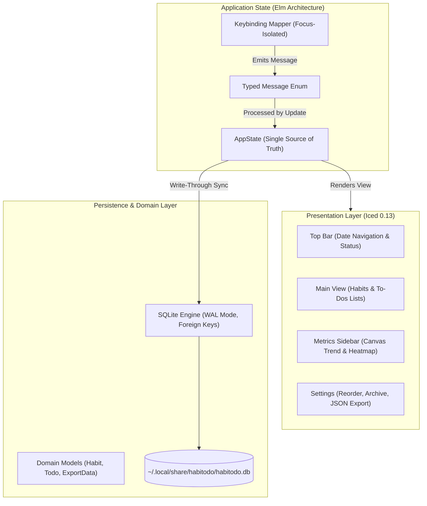

# Habitodo

<div align="center">


### Fast, Keyboard-Driven, Native Dark-Mode Habit & To-Do Tracker

[](https://www.rust-lang.org/)
[](https://github.com/iced-rs/iced)
[-003B57?style=flat-square&logo=sqlite)](https://www.sqlite.org/)
[](https://kernel.org/)
[](#license)

</div>

---

**Habitodo** is a distraction-free, 100% offline desktop productivity application built from the ground up in Rust. It pairs non-negotiable daily recurring habits with actionable to-dos, complete with an Elm-inspired unidirectional state engine, a dark-mode UI, hardware-accelerated canvas analytics, and a Vim-inspired keyboard workflow.

---

## Table of Contents
- [Key Features](#key-features)
- [Architecture & Tech Stack](#architecture--tech-stack)
  - [Why This Stack?](#why-this-stack)
- [Keyboard Shortcuts](#keyboard-shortcuts)
- [Installation Guide](#installation-guide)
  - [Automatic Installation (Desktop Menu Integration)](#automatic-installation-desktop-menu-integration)
  - [Manual Installation](#manual-installation)
  - [Uninstallation](#uninstallation)
- [Command-Line Interface (CLI)](#command-line-interface-cli)
- [Development & CI/CD Testing](#development--cicd-testing)
- [License](#license)

---

## Key Features

* **Daily Non-Negotiable Habits**: Track daily recurring routines with atomic toggle status, visual completion strikethrough, and consecutive streak tracking.
* **Flexible To-Dos**: Organize daily tasks with due dates, completion timestamps, and attached notes.
* **Canvas Trend Charts**: A custom vector-rendered 14/30-day historical completion curve with data points and guide grids.
* **Monthly Heatmap Calendar**: GitHub-style activity grid visualizing month-wide completion density across tiered opacities.
* **Per-Habit Consistency Rates**: 30-day percentage progress bars for individual habit discipline auditing.
* **Vim-First Navigation**: Full keyboard control (`j`/`k`, `h`/`l`, `g`/`G`, `Space`, `Tab`, `?`) with strict text-input focus isolation.
* **100% Local & Private**: No analytics, telemetry, or remote servers. All data lives in your local SQLite database at `~/.local/share/habitodo/habitodo.db`.
* **Portable Backups**: One-key JSON export and atomic transactional import with rollback protection.

---

## Architecture & Tech Stack



### Why This Stack?

| Technology | Selection Rationale |
| :--- | :--- |
| **Rust (2021 Edition)** | **Performance, Safety & Predictability**: Memory safety without garbage collection pauses (no stuttering animations or dropped input events). Compiles to a self-contained, standalone native binary (~20MB) with zero external runtime dependencies. |
| **Iced (0.13.1)** | **Native GUI without Web Bloat**: Traditional desktop apps built on Electron or web views consume 300MB+ of RAM and require Chromium subprocesses. Iced provides a pure Rust GUI rooted in the **Elm Architecture** (Model-View-Update), guaranteeing predictable state mutations, sub-millisecond input handling, and hardware-accelerated canvas drawing via `WGPU`/`softbuffer`. |
| **SQLite via `rusqlite` (0.32 bundled)** | **Embedded, Robust ACID Storage**: Bundled directly with zero system configuration required. Enabled with **WAL Mode** (`PRAGMA journal_mode = WAL`) to support non-blocking concurrent reads during writes, foreign key cascade deletion, and transactional rollbacks on corrupt import payloads. |
| **Serde & Serde JSON** | **Safe, Versioned Portability**: Strongly-typed schema serialization ensures export backups are clean, human-readable, and reliably restored across machines. |

---

## Keyboard Shortcuts

Habitodo is built to be operated entirely without touching a mouse. Press `?` anywhere to bring up the in-app cheat sheet.

### Global
| Key | Action |
| :--- | :--- |
| `q` | Quit Habitodo |
| `s`, `Tab` | Toggle metrics sidebar (auto-collapses on small windows) |
| `?` | Toggle shortcuts help modal |

### Main Dashboard
| Key | Action |
| :--- | :--- |
| `j`, `↓` | Move selection down |
| `k`, `↑` | Move selection up |
| `h`, `←` | Previous day |
| `l`, `→` | Next day |
| `t` | Jump to today |
| `g` / `G` | Jump to top / bottom of list |
| `Space` | Toggle completion status |
| `x` | Complete / dismiss selected item |
| `i` | Add new to-do task (inline input) |
| `Enter` | Edit selected to-do |
| `d` | Delete selected to-do (prompts confirmation) |
| `n` | Edit notes attached to selected to-do |
| `o` | Open Settings screen |
| `Esc` | Close modal / clear status |

### Settings Screen
| Key | Action |
| :--- | :--- |
| `j`, `k` | Navigate habit list |
| `K` / `J` | Move selected habit up / down (reorder priority) |
| `i` | Add new habit |
| `r` | Rename selected habit |
| `d` | Archive habit (soft delete, retains historical stats) |
| `e` | Export backup data to JSON |
| `o`, `Esc` | Return to Main dashboard |

---

## Installation Guide

### Prerequisites
Make sure you have the Rust toolchain installed:
```bash
curl --proto '=https' --tlsv1.2 -sSf https://sh.rustup.rs | sh
```

### Automatic Installation (Desktop Menu Integration)
Clone the repository and run the automated installer:
```bash
git clone https://github.com/Pierorivera1/habitodo.git
cd habitodo
./install.sh
```

**What the installer does:**
1. Compiles the optimized release binary (`cargo build --release`).
2. Installs the binary to `~/.local/bin/habitodo`.
3. Installs the high-resolution vector icon to `~/.local/share/icons/hicolor/scalable/apps/habitodo.svg`.
4. Registers the XDG desktop entry at `~/.local/share/applications/habitodo.desktop`.
5. Updates your desktop application and icon database (`update-desktop-database`).

You can immediately launch **Habitodo** from your system application menu (GNOME, KDE, Rofi, Wofi, dmenu, etc.) or by typing `habitodo` in any terminal!

> [!NOTE]
> Make sure `~/.local/bin` is in your `PATH`. If it isn't already, add this to your `~/.bashrc` or `~/.zshrc`:
> ```bash
> export PATH="$HOME/.local/bin:$PATH"
> ```

---

### Manual Installation

If you prefer to install manually step-by-step:

```bash
# 1. Build release binary
cargo build --release

# 2. Copy binary to your local user bin directory
mkdir -p ~/.local/bin
cp target/release/habitodo ~/.local/bin/
chmod +x ~/.local/bin/habitodo

# 3. Install desktop entry and application icon
mkdir -p ~/.local/share/applications ~/.local/share/icons/hicolor/scalable/apps
cp assets/habitodo.desktop ~/.local/share/applications/
cp assets/habitodo.svg ~/.local/share/icons/hicolor/scalable/apps/

# 4. Refresh desktop and icon caches
update-desktop-database ~/.local/share/applications/
gtk-update-icon-cache -f -t ~/.local/share/icons/hicolor/ 2>/dev/null || true
```

---

### Uninstallation

To cleanly remove Habitodo from your system:
```bash
./uninstall.sh
```
*(Your habit and task database in `~/.local/share/habitodo/` is kept safe and untouched).*

---

## Command-Line Interface (CLI)

Habitodo provides built-in CLI flags for quick inspection and headless self-diagnostics:

```bash
# Show usage and keybinding cheat sheet
habitodo --help

# Show version information
habitodo --version

# Run headless self-verification diagnostics against SQLite
habitodo --verify
```

---

## Development & CI/CD Testing

The test suite is 100% headless, requires no display server (`DISPLAY` or `WAYLAND_DISPLAY`), and finishes in under 0.1s.

```bash
# Run all unit and integration tests headlessly
cargo test

# Check code formatting & idioms
cargo clippy --all-targets -- -D warnings

# Build development binary
cargo build
```

---

## License

Dual-licensed under either:
* **MIT License** ([LICENSE-MIT](LICENSE-MIT) or [http://opensource.org/licenses/MIT](http://opensource.org/licenses/MIT))
* **Apache License, Version 2.0** ([LICENSE-APACHE](LICENSE-APACHE) or [http://www.apache.org/licenses/LICENSE-2.0](http://www.apache.org/licenses/LICENSE-2.0))

at your option.
